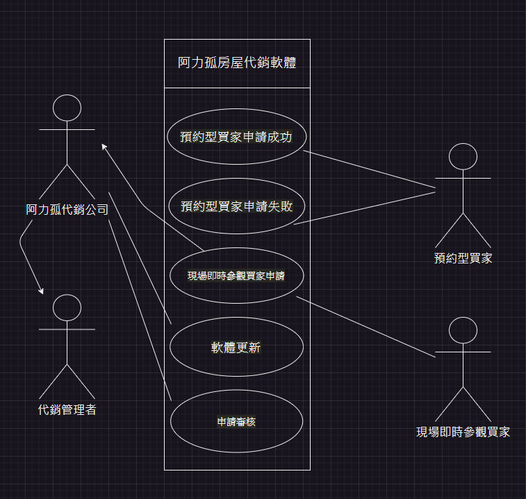

# 期中考-期中-Mid 
<!--(期中標籤註記，該行不能刪，作為驗證標籤，該檔案若沒該份標籤，代表直接貼上saample，直接0分)-->

>
>學號：111104105
> 
>姓名：陳郁升
> 

本份文件包含以下主題：(至少需下面兩項，若是有多者可以自行新增)
- [x] 答題

## 答題
>1. 

(a)利害關係人表
| 利害人 | 目標 |  
|---|---|
阿力孤代銷公司| 1.提升服務品質。 2.增加銷售效率。 3.減少人工作業上的錯誤。 
代銷管理者|1.提高工作效率。 2.合理安排時程。 3.減少人工作業上的錯誤。 
預約型買家|1.更簡單的預約流程。 2.充分了解房屋情況。 3.及時得知預約結果。 
現場即時參觀買家|1.即時能夠獲得看房機會。 2.充分了解房屋情況。 3.提高看房效率。 

事件表
|案例名稱|事件描述|
|---|---|
預約型買家申請成功|	預約型買家填寫申請後，後台審核通過，安排代銷接待，並將成功訊息推送給預約買家進行 Line 訊息推播。
預約型買家申請失敗|	預約型買家填寫申請後，後台無法安排合適的時段，將失敗訊息推送給預約買家進行 Line 訊息推播，並要求重新填寫申請單。
現場即時參觀買家申請|現場即時參觀買家填寫申請後，後台立即安排了閒置的代銷進行分配，並將對應的訊息推播至現場即時參觀買家。
軟體更新|	軟體隨著的市場需求而改變，包括安全性、系統便利性，需通知相關人員進行相應的更新。
申請審核|  後台審核預約型買家或現場即時參觀買家的申請，確保時程無誤，並安排合適的代銷接待。

(b) 系統使用案例圖  

(c)使用案例
|案例名稱|預約型買家申請成功|
|---|---|
案例描述|預約型買家填寫預約申請後，經後台審核通過並安排代銷接待，最終成功預約參觀物件。
主要參與者|預約型買家、代銷管理者
利害關係人與目標|預約型買家：希望成功預約參觀物件，了解房屋情況。 代銷管理者：確保申請流程順利，並提供良好的服務品質。 
前置條件|預約型買家填寫預約申請，後台審核通過。
後置條件|預約型買家成功預約參觀物件。
主要成功情節|1.預約型買家填寫預約申請表。 2.申請送至後台進行審核。 3.後台審核通過申請。 4.代銷管理者安排合適的時段和接待代銷人員。 
另外情節與其他需求|  若後台審核未通過，將通知預約型買家重新填寫申請單或更改時間段。
   
|案例名稱|預約型買家申請失敗|
|---|---|
案例描述|預約型買家填寫預約申請後，後台無法找到合適的時段進行安排。軟體系統把失敗訊息推送給預約型買家，透過 Line 訊息推播通知她預約失敗，並要求她重新填寫申請單或更改時間段。
主要參與者|預約型買家、代銷管理者
利害關係人與目標|預約型買家：希望成功預約參觀物件，了解房屋情況。 代銷管理者：確保申請流程順利，並提供良好的服務品質。 
前置條件|預約型買家填寫預約申請。
後置條件|預約型買家重新填寫申請單。
主要成功情節|1.預約型買家填寫預約申請表。 2.申請送至後台進行審核。 3.後台無法找到合適的時段進行安排。。 4.失敗訊息推送給預約型買家，要求她重新填寫申請單或更改時間段。 
另外情節與其他需求|  若後台審核通過，但在安排時段時發生錯誤，需要通知預約型買家重新填寫申請單。
  
|案例名稱|現場即時參觀買家申請|
|---|---|
案例描述|現場即時參觀買家填寫申請後，後台立即安排了閒置的代銷人員進行分配，並將對應的訊息推播至現場即時參觀買家。
主要參與者|現場即時參觀買家、代銷管理者
利害關係人與目標|現場即時參觀買家：希望能立即參觀物件，以方便做出決定。  代銷管理者：確保即時參觀買家得到有效的安排。 
前置條件| 現場即時參觀買家填寫申請。
後置條件| 現場即時參觀買家成功安排參觀。
主要成功情節|1.現場即時參觀買家填寫申請表。 2.代銷管理者立即安排閒置的代銷進行分配。 3.相應訊息推播至現場即時參觀買家。 
另外情節與其他需求|  若申請成功當下無閒置的代銷可分配，需要通知現場即時參觀買家等待或安排其他時間。
  
|案例名稱|軟體更新|
|---|---|
案例描述|根據市場需求，軟體需要進行更新，其中包括安全性和系統便利性的改進。
主要參與者|阿力孤代銷公司的系統管理員、軟體使用者
利害關係人與目標|系統管理者：確保系統安全性和功能更新。 軟體使用者：能夠使用到最新版本的軟體，提升使用上的體驗。 
前置條件| 確認有新版本的軟體需要更新。
後置條件| 系統更新完成，軟體使用者可以使用最新版本的軟體。
主要成功情節|1.系統管理者發現軟體需要更新。 2.通知相關使用者進行軟體更新。 3.使用者成功完成軟體更新。 
另外情節與其他需求|  若使用者無法完成軟體更新，需要提供技術支援或者提供替代方法。
  
(d)

>2. 

(a)

(b)

(c)

(d)

